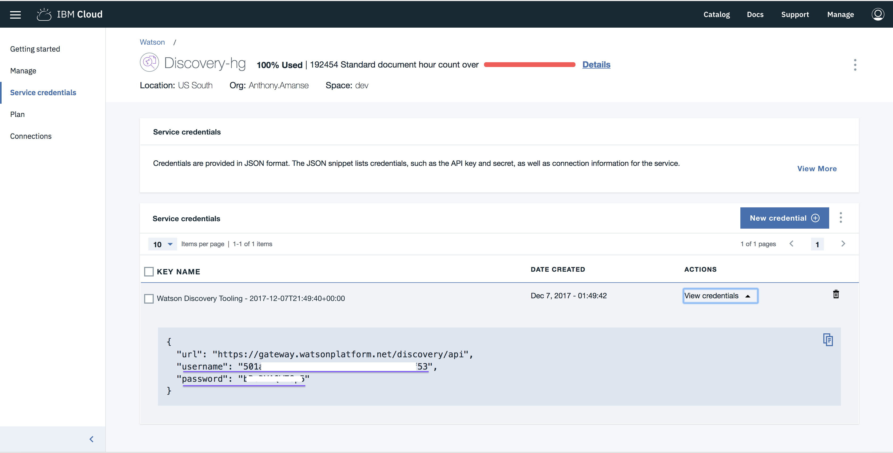
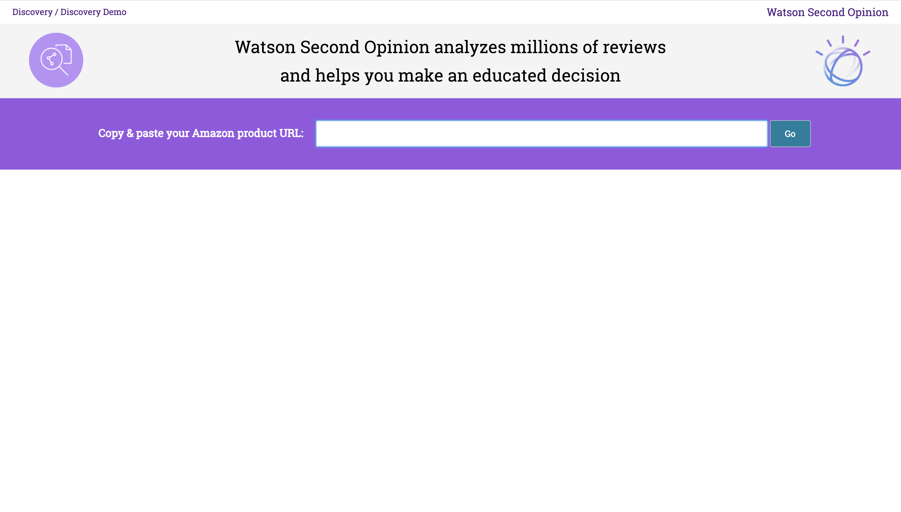
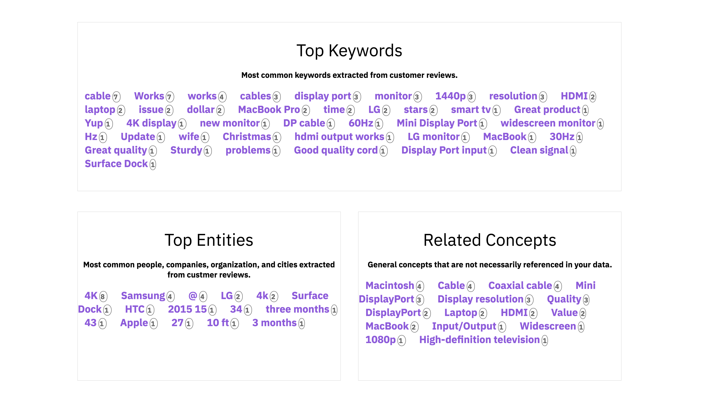

[](https://travis-ci.org/IBM/watson-second-opinion)

# Create a Review Analyzer with Watson Natural Language Understanding

In this Code Pattern, we will create a Node.js app that takes the reviews from an online shopping website, Amazon, and feeds them into the Watson Natural Language Understanding service. The reviews will be stored in a Cloudant database. The Watson Natural Language Understanding service will show the overall sentiments of the reviews. The sample application will do all the reading of reviews for you and will give an overall insight about them. The Code Pattern can be useful to developers that are looking into processing multiple documents with Watson Natural Language Understanding.

When the reader has completed this Code Pattern, they will understand how to:

* Interact with Watson Natural Language Understanding using Watson's Node SDK
* Build a user interface around the result of Watson Natural Language Understanding
* Create and use Cloudant NoSQL Database
* Deploy a Nodejs application to analyze product reviews

<!--Remember to dump an image in this path-->


## Flow
1. The user deploys the app in IBM Cloud. The user interacts with the user interface of the app.
2. The user enters the product URL and the app would start getting the reviews of the Product.
3. The app then stores the reviews in a database for later use.
4. The app starts to upload the reviews in Watson Natural Language Understanding.
5. After Watson Natural Language Understanding finishes processing the reviews, the app then stores the result (General Sentiment and Top Entities) in Cloudant. The user will see the result in the UI.

## Included components
* [Watson Natural Language Understanding](https://www.ibm.com/watson/services/natural-language-understanding/):  Analyze text to extract meta-data from content such as overall sentiment, emotion, concepts, entities, keywords, categories, relations and semantic roles.
* [Cloudant NoSQL DB](https://console.ng.bluemix.net/catalog/services/cloudant-nosql-db): A fully managed data layer designed for modern web and mobile applications that leverages a flexible JSON schema.

## Featured technologies
* [Node.js](https://nodejs.org/): An open-source JavaScript run-time environment for executing server-side JavaScript code.
* [Databases](https://en.wikipedia.org/wiki/IBM_Information_Management_System#.22Full_Function.22_databases): Repository for storing and managing collections of data.
* [Cloud](https://www.ibm.com/developerworks/learn/cloud/): Accessing computer and information technology resources through the Internet.

## Watch the Video

[](https://www.youtube.com/watch?v=wwNAEvbxd54&list=PLVztKpIRxvQXhHlMQttCfYZrDN8aELnzP&index=1&t=1s)

# Steps

1. [Clone the repo](#1-clone-the-repo)
2. [Create IBM Cloud services](#2-create-ibm-cloud-services)
3. [Build your Docker image](#3-build-your-docker-image)
4. [Configure deployment files](#4-configure-deployment-files)
5. [Deploy the application](#5-deploy-the-application)
6. [Search for a product in Amazon](#6-search-for-a-product-in-amazon)

## Deploy to IBM Cloud
If you do not have an IBM Cloud account yet, you will need to create one [here](https://ibm.biz/BdjLxy).

[](https://bluemix.net/deploy?repository=https://github.com/IBM/watson-second-opinion)

1. Press the above `Deploy to IBM Cloud`
    > The toolchain uses GitHub for its source control. You may be asked to authenticate the toolchain to use your account. The toolchain will clone this repo and will be used for its deployment.
<!--optional step-->
2. In Toolchains, click on ``Delivery Pipeline`` to watch while the app is deployed. Once deployed, the app can be viewed by clicking ``View app``.

<!--update with service names from manifest.yml-->
3. To see the app and services created and configured for this Code Pattern, use the IBM Cloud dashboard. The app will be named according to what you inputted in the toolchain. The following services are created and easily identified by the `wso-` prefix:
    * wso-nlu
    * wso-cloudant

### Update the Environment of your deployed app


1. Navigate to https://console.bluemix.net/dashboard/apps/
2. Located and click on your newly created application 
3. Select 'Runtime' in the left menu
4. Select the 'Environment Variables' tab in the middle of the page
5. Scroll down to the User defined variables section
6. Click on ``add``. 
7. THIS IS EXTREMELY IMPORTANT. Make sure to write the name of the env variable EXACTLY as shown, otherwise, the app wont work. Scroll up until you see `VCAP_SERVICES`. You will then see `cloudantNoSQLDB` and under that `url`.  Under 'Name', type in `CLOUDANT_URL`, and under 'Value', paste the `url` value from the `cloudantNoSQLDB` section of `VCAP_SERVICES`.


8. Repeat step 6 but now under name, type in `NLU_USERNAME` and under value go to `natural-language-understanding` section of the `VCAP_SERVICES` and get the value for `username`.
9. Repeat step 6 but now under name, type in `NLU_PASSWORD`, and under value go `natural-language-understanding` section of the `VCAP_SERVICES` and get the value for `password`.
10. Click ``save``.
11. Nice job! You are done. Click on ``visit App URL`` at the top of the page to interact with the app. Simply copy and paste an Amazon URL from a product page into the app, and click on the magnifying glass and voilà! You will get some valuable insights from Watson.

## Deploy Locally

### 1. Clone the repo

```
$ git clone https://github.com/IBM/watson-second-opinion
$ cd watson-second-opinion/
```

### 2. Install Dependencies

```
$ npm install
```

### 3. Create IBM Cloud services

Create the following service:

* [**Watson Natural Language Understanding**](https://console.bluemix.net/catalog/services/natural-language-understanding)
* [**Cloudant NoSQL DB**](https://console.ng.bluemix.net/catalog/services/cloudant-nosql-db/)

### 4. Set environment variables


```
$ 
$ docker push YOUR_DOCKERHUB_USERNAME/watson-review-analyzer:1.0
```

### 4. Configure deployment files
Login to IBM Cloud (formerly called Bluemix). If not an IBM employee, use your IBM Cloud account username and password to login

```
$ bx login
```

If IBM employee, use --sso option and follow link for one time code, and use it to login.

```
$ bx login --sso
```


After you are logged in to IBM Cloud, you should see something like this:

```
API endpoint: https://api.ng.bluemix.net

One Time Code (Get one at https://iam-id-2.ng.bluemix.net/identity/passcode)>
Authenticating...
OK

Targeted account IBM (d5a44c1--------1a852cef31136c)

Targeted resource group default


API endpoint:     https://api.ng.bluemix.net (API version: 2.92.0)
Region:           us-south
User:             horea.porutiu@ibm.com
Account:          IBM (d5a44c1--------1a852cef31136c)
Resource group:   default
```

Next, setup kubectl to use your cluster

```
$ bx cs cluster-config <your-cluster-name>
```
Use the configuration for your cluster by exporting the environment variables - copy and paste the full line starting with:

```
$ export KUBECONFIG=
```

Add your Watson Natural Language Understanding credentials in `config.json.sample` and rename it to `config.json`:



`config.json`:
```
{
  "nluUsername" : "YOUR_WATSON_NLU_USERNAME",
  "nluPassword" : "YOUR_WATSON_NLU_PASSWORD"
}
```

Create configmap in Kubernetes for `config.json`

```
$ kubectl create configmap watson-discovery-config --from-file=config.json
```

Modify `watson-review-analyzer.yaml`. In the line where you specify the image name, use the docker image you just built.  
Change `horeaporutiu/watson-review-analyzer:2.1` to `YOUR_DOCKERHUB_USERNAME/watson-review-analyzer:1.0`.

<pre>
    spec:
      containers:
        - image: <b>horeaporutiu/watson-review-analyzer:2.1</b>
          imagePullPolicy: Always
          name: watson-reviews
</pre>

### 5. Deploy the application
<!--Deploy in kubernetes (1) nodejs app and (2) Cloudant instance. Access via external ip-->

Deploy the CouchDB database. This is where the reviews and Watson Natural Language Understanding results will be stored.

```
$ kubectl apply -f couchdb.yaml
```

Deploy the Watson Review Analyzer app.

```
$ kubectl apply -f watson-review-analyzer.yaml
```

Check if your Pods are running. You should see a couchdb pod and the watson-review-analyzer pod.

```
$ kubectl get pods

NAME                                         READY     STATUS    RESTARTS   AGE
couchdb-deployment-78c87bf5bf-2nhc2          1/1       Running   0          4d
watson-reviews-deployment-859b8d454f-4zxkw   1/1       Running   0          4d
```

You can access the application in the browser via the Load Balancer's IP (External IP).
If you don't have the Load Balancer enabled, you can access it through one of your Kubernetes' worker IP and service Node port of watson-review-analyzer.

<pre>
$ kubectl get service

NAME             CLUSTER-IP       EXTERNAL-IP      PORT(S)          AGE
couchdb          172.21.174.52    169.xy.xyz.220   5984:32402/TCP   13d
kubernetes       172.21.0.1       &ltnone&gt           443/TCP          27d
watson-reviews   172.21.254.246   <b>169.48.xyz.221</b>   80:<b>31385</b>/TCP     15m
</pre>

If you don't have the Load Balancer and need the worker IP:
<pre>
$ bx cs workers YOUR_CLUSTER_NAME

OK
ID                                                 Public IP       Private IP       Machine Type   State    Status   Zone    Version
kube-dal12-cr5c30966926aa444f9c02c72d5c3e1ca5-w1   <b>169.xy.xyz.35</b>   10.184.120.196   b2c.16x64      normal   Ready    dal12   1.8.6_1506*
</pre>

Go to `169.xy.xyz.221` or `169.xy.xyz.35:31385` (for clusters without a Load Balancer)



### 6. Search for a product in Amazon

To use the app, search for the product you want the reviews to be uploaded to Watson Natural Language Understanding and get its product ID (ASIN).

`https://www.amazon.com/Samsung-Thinnest-Premium-Anti-Scratch-Protective/dp/`**`B06XZ2CM2H`**`/ref=cm_cr_arp_d_product_top?ie=UTF8`

In this case, the product ID is **B06XZ2CM2H**


Go ahead and press `Go`.

After Watson Natural Language Understanding finishes processing all the reviews, the app should show you its General Sentiment and Top entities found.



# Privacy Notice

Sample Kubernetes Yaml file that includes this package may be configured to track deployments to [IBM Cloud](https://www.bluemix.net/) and other Kubernetes platforms. The following information is sent to a [Deployment Tracker](https://github.com/IBM/metrics-collector-service) service on each deployment:

* Kubernetes Cluster Provider(`IBM Cloud, Minikube, etc`)
* Kubernetes Cluster ID (Only from IBM Cloud's cluster)

This data is collected from the Kubernetes Job in the sample application's yaml file. This data is used by IBM to track metrics around deployments of sample applications to IBM Cloud to measure the usefulness of our examples so that we can continuously improve the content we offer to you. Only deployments of sample applications that include code to ping the Deployment Tracker service will be tracked.

## Disabling Deployment Tracking

Please comment out/remove the Metric Kubernetes Job portion in the `watson-review-analyzer.yaml` file.

# Links

* [Watson Node.js SDK](https://github.com/watson-developer-cloud/node-sdk)

# Learn more

* **Node.js Code Patterns**: Enjoyed this Code Pattern? Check out our other [Node.js Code Patterns](https://developer.ibm.com/code/technologies/node-js/)
* **Artificial Intelligence Code Patterns**: Enjoyed this Code Pattern? Check out our other [AI Code Patterns](https://developer.ibm.com/code/technologies/artificial-intelligence/).
* **AI and Data Code Pattern Playlist**: Bookmark our [playlist](https://www.youtube.com/playlist?list=PLzUbsvIyrNfknNewObx5N7uGZ5FKH0Fde) with all of our Code Pattern videos
* **With Watson**: Want to take your Watson app to the next level? Looking to utilize Watson Brand assets? [Join the With Watson program](https://www.ibm.com/watson/with-watson/) to leverage exclusive brand, marketing, and tech resources to amplify and accelerate your Watson embedded commercial solution.

# License
[Apache 2.0](LICENSE)
